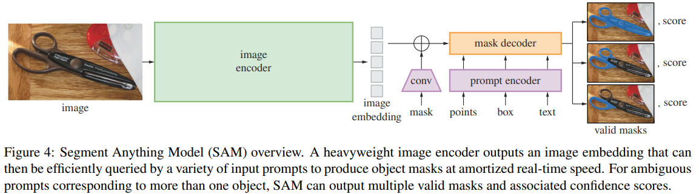

# SEGMENT-ANYTHING MODEL

*Knowledge provided by* [AI VIET NAM](https://aivietnam.edu.vn/) 

---

Click <a href= ./demo_webui/README.md> here </a> for demo web-ui

## Overview

    

### Image Encoder
Using an MAE pre-trained Vision Transformer (ViT) minimally adapted to process high resolution inputs. The image encoder runs once per image and can be applied prior to prompting the model.

### Prompt Encoder
Considering two sets of prompts: sparse (points, boxes, text) and dense (masks). Authors represent points and boxes by positional encodings summed with learned embeddings for each prompt type and free-form text with an off-the-shelf text encoder from CLIP. Dense prompts (i.e., masks) are embedded using convolutions and summed element-wise with the image embedding.

### Mask Decoder
The mask decoder efficiently maps the image embedding, prompt embeddings, and an output token to a mask. This design, employs a modification of a Transformer decoder block followed by a dynamic mask prediction head. Our modified decoder block uses prompt self-attention and cross-attention in two directions (prompt-to-image embedding and vice-versa) to update all embeddings. After running two blocks, authors upsample the image embedding and an MLP maps the output token to a dynamic linear classifier, which then computes the mask foreground probability at each image location.

