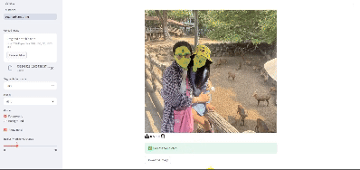

# Segment Anything Model webui (Streamlit)

<div align = "center"></div>

____________________
## Install Streamlit
```
> git clone https://github.com/mminh007/segment-anything.git
> cd demo_webui
> pip install streamlit streamlit-drawable-canvas
```
_________________________________
## Install dependencies and get checkpoints
```
git clone https://github.com/facebookresearch/segment-anything.git
cd segment-anything; pip install -e .

mkdir checkpoints
wget https://dl.fbaipublicfiles.com/segment_anything/sam_vit_b_01ec64.pth -O checkpoint/sam_vit_b_01ec64.pth
wget https://dl.fbaipublicfiles.com/segment_anything/sam_vit_l_0b3195.pth -O checkpoint/sam_vit_l_0b3195.pth
wget https://dl.fbaipublicfiles.com/segment_anything/sam_vit_h_4b8939.pth -O checkpoint/sam_vit_h_4b8939.pth
```

__________________________
## Run script
```
streamlit run ./pages/segment-anything.py
```
__________________________
# NOTE
